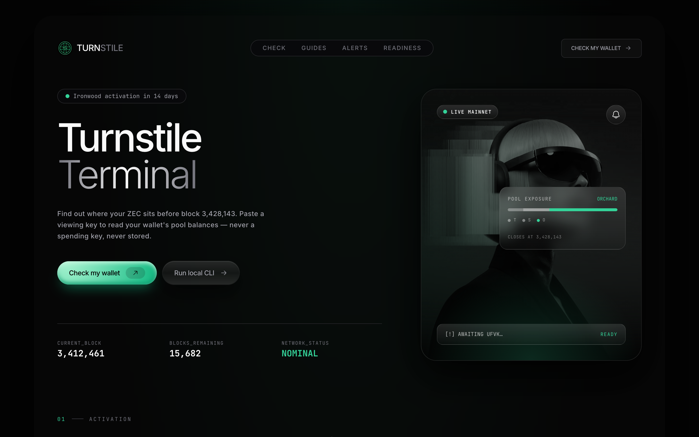
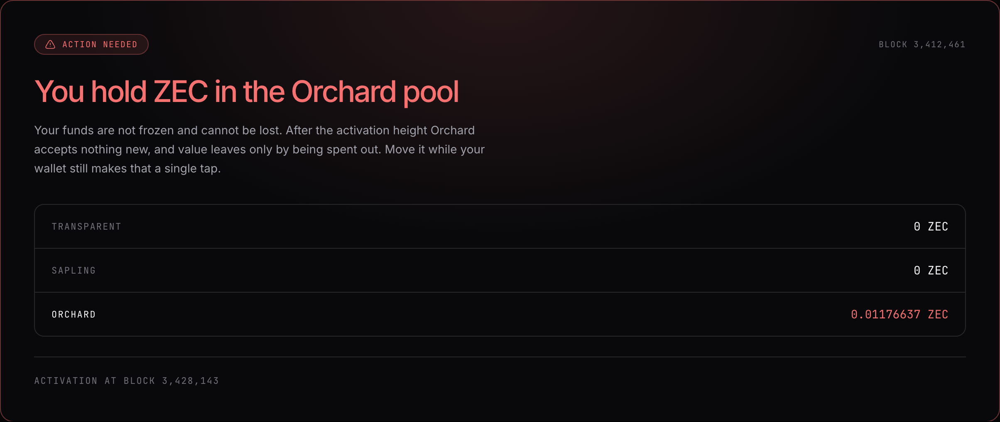
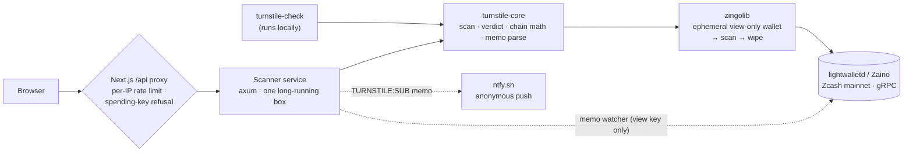

<div align="center">



&nbsp;

[](LICENSE)


### Is your ZEC ready for Ironwood? Find out in under a minute — without ever touching a spending key.

On ~28 July 2026, at block **3,428,143**, the Ironwood upgrade seals the Orchard shielded pool: no new deposits, no internal transfers. Every shielded wallet is affected, and the question every ZEC holder is about to ask has no tool to answer it — _am I exposed, and what do I do?_ Turnstile reads your wallet with a **unified full viewing key** — a key that can *see* but can never *spend* — tells you pool-by-pool where your funds actually sit, and walks you through the fix for your specific wallet. The trust proposition is enforced in code, not promised in copy: there is no path that accepts a spending key, and your viewing key never reaches a log, a database, or a URL.

**[ Run it locally ↗ ](#run-it-locally)** &nbsp;·&nbsp; **[ The safety model ↗ ](#the-one-rule--never-a-spending-key)** &nbsp;·&nbsp; **[ See a real scan ↗ ](#-see-it-in-one-command)** &nbsp;·&nbsp; **[ What's real vs pending ↗ ](#whats-real-vs-pending--the-honesty-table)** &nbsp;·&nbsp; **[ Architecture ↗ ](#architecture)**

Built for **ZecHub Hackathon 3.0** · Infrastructure track · MIT licensed. _An educational tool, not financial advice — always verify against official sources._

</div>

---

## ▶ See it in one command

The `turnstile-check` CLI runs the whole scan on your own machine and sends nothing anywhere. This is real output, against mainnet, from a wallet holding real ZEC in Orchard:

```console
$ cargo run -p turnstile-check -- --ufvk uview1... --birthday 3411399

  TRANSPARENT   0 ZEC
  SAPLING       0 ZEC
  ORCHARD       0.01176637 ZEC

  You hold ZEC in the Orchard pool
  Your funds are not frozen and cannot be lost. After the activation height Orchard accepts
  nothing new, and value leaves only by being spent out. Move it while your wallet still makes
  that a single tap.
  Activation is at block 3428143.
  Scanned to block 3,412,461.
```

That verdict came from a **viewing key alone** — the wallet's spending key never went near Turnstile. And when the same scan runs on the server, its logs for the job read, in full:

```log
INFO turnstile_scanner::jobs: scan complete job=39e4fbe01 verdict=Exposed scanned_to_height=3412461
```

No key. No balance. No address. Grep them yourself — that grep returning nothing is the entire product in one line.

---

## The one rule — never a spending key

A viewing key can *see*; it can never *spend*. That is Zcash selective disclosure working as designed, and it is the whole trust model. **Turnstile cannot accept a spending key or a seed phrase.** There is no code path that takes one:

- The **browser** refuses it before any request is made — a seed phrase or a `secret-extended-key…` / `uskmain…` prefix is cleared client-side, so it never leaves the machine.
- The **API** refuses it again before anything reaches the scanner.
- The viewing key that *is* accepted lives in memory for the duration of the scan and is then dropped. It is never written to a log, a database, or a URL. `ScanRequest` has a hand-written `Debug` that prints `<redacted>`, so a stray log line **cannot** leak it.

Be clear-eyed about what a viewing key *does* expose, wherever you paste it: your balances, your full in-and-out history, memos, and counterparties. If you would rather send us nothing at all, **run the CLI** — it is a first-class path, not a fallback.

### The four verdicts

| | Verdict | Meaning |
|:--:|---|---|
| 🔴 | **Action needed** | You hold ZEC in Orchard. Not frozen, not lost — but move it. |
| 🟡 | **Nothing to do** | Funds sit in transparent or Sapling. The activation does not touch them. |
| 🟢 | **Ready** | No funds in any pool visible to this key. |
| ⚪ | **Cannot determine** | The key carries **no Orchard viewing capability** — so Turnstile refuses to guess. |

That fourth verdict is the one most tools get wrong. ZIP-316 permits a valid `uview1…` key that contains a Sapling key but **no Orchard key**. Such a key cannot see Orchard at all — and reporting *"0 in Orchard, you're safe"* for it would be a false all-clear, the worst failure this tool could have. Turnstile models every pool as an `Option`: a pool invisible to your key renders as *not visible to this key*, **never as a zero balance**.

---

## Table of contents

- [The wallet readiness check](#the-wallet-readiness-check--the-hero-feature)
- [The activation countdown](#the-activation-countdown)
- [Migration guides](#migration-guides)
- [Anonymous alerts, without an account](#anonymous-alerts-without-an-account)
- [The ecosystem readiness board](#the-ecosystem-readiness-board)
- [Architecture](#architecture)
- [Safety, enforced in code](#safety-enforced-in-code)
- [Engineering decisions & the hard problems](#engineering-decisions--the-hard-problems)
- [What's real vs pending — the honesty table](#whats-real-vs-pending--the-honesty-table)
- [Tests](#tests)
- [Run it locally](#run-it-locally)
- [Configuration](#configuration)
- [Deploy](#deploy)
- [Project layout](#project-layout)
- [Tech stack](#tech-stack)
- [Credits](#credits)
- [Roadmap](#roadmap)
- [Disclaimer & license](#disclaimer)

---

## The wallet readiness check — the hero feature



Paste a unified full viewing key, optionally give the wallet's birthday height, and Turnstile scans mainnet through [zingolib](https://github.com/zingolabs/zingolib), breaks the balance down by pool, and renders the verdict card above — the screenshot that ends up in Discord.

The scan is honest about its own edges:

- **Every pool is an `Option`.** A pool your key can't see renders *not visible to this key*, never `0`. (See [the four verdicts](#the-four-verdicts).)
- **The birthday never causes a false all-clear.** A birthday above the chain tip is refused rather than silently returning "nothing found."
- **Dust is disclosed, not hidden.** zingolib reports balances excluding dust notes (≤ 5,000 zatoshi); a wallet holding *only* dust in Orchard is reported as clear, and the docs say so.

The `birthday` is optional: leave it blank and Turnstile scans from Orchard activation — always correct, just slower. Scan time scales with blocks since birthday, which is exactly why the CLI exists as a first-class, fully-local path.

## The activation countdown

<div align="center">

`CURRENT_BLOCK 3,412,461` &nbsp;·&nbsp; `BLOCKS_REMAINING 15,682` &nbsp;·&nbsp; `NETWORK_STATUS NOMINAL`

</div>

Live mainnet height and blocks remaining until 3,428,143, read from the indexer every minute, with an ETA derived from the 75-second block target and drift-corrected against recent block timestamps. It has three phases — pre-activation, a ±20-block "it's happening" window, and post-activation — and one hard rule: **when the chain tip is unreachable, it shows `—` and refuses to fabricate a height.** A countdown that guesses is worse than a countdown that admits it can't see.

## Migration guides


Per-wallet, step-by-step guidance for **Zashi, YWallet, Zingo PC, Zallet,** and **ZEC held on an exchange** — adapted from the [ZecHub wiki](https://zechub.wiki) with attribution. The picker is honest about reach: not every wallet exports a viewing key, so the badge says plainly whether a wallet is *checkable in Turnstile* or whether the guide will instead show you how to read the balance **inside the wallet**. Every guide ends with "re-run the check to confirm."

## Anonymous alerts, without an account

Subscribe with no email, no account, and no identifier — by sending a shielded mainnet memo. Send **0.0001 ZEC** to the Turnstile address with the memo:

```
TURNSTILE:SUB:<your-topic>
```

The watcher reads the encrypted memo from the chain, registers your anonymous [ntfy.sh](https://ntfy.sh) topic, and pushes a confirmation. Proven end to end on mainnet — a real shielded memo, decrypted from the chain, pushed:

```log
tx ff53f470… carries memo TURNSTILE:SUB:turnstile-demo-7f3a

INFO turnstile_scanner::alerts: new subscription topic=turnstile-demo-7f3a height=3412465
    → ntfy: "Turnstile — you are subscribed"
```

No PII of any kind changed hands. **The chain was the signup form.** And the watcher is given a **viewing key, not a spending key** — it only needs to read memos, so the server *cannot spend the dust it is sent*, by construction rather than by policy.

> **Honest scope:** today the watcher delivers the one-shot subscription confirmation shown above. The scheduled T-48h / T-1h / at-activation pushes are on the [roadmap](#roadmap), not yet implemented — see the [honesty table](#whats-real-vs-pending--the-honesty-table).

## The ecosystem readiness board


A curated, dated, sourced board of wallets, exchanges, and infrastructure and whether each has publicly committed to Ironwood. Its framing is the point: a row says **ready** only when someone has published something we can link to. When we can't find a statement, the board says *"said nothing we could find"* — because we would rather admit that than colour a square green. (At last review, 15 of 24 fell in that bucket, and the board says so.)

---

## Architecture



The scan logic is written **once**. `turnstile-core` owns the domain — the UFVK scan, the verdict rules, the countdown maths, and memo parsing — and both the scanner service and the CLI are thin shells over it. A verdict rule fixed in `core` is fixed everywhere.

The safety guarantees live at the boundary the browser can reach: **the per-IP rate limit and the spending-key refusal are enforced in the Next.js proxy**, so the scanner is never exposed directly. The scanner is a *separate, long-running service* on purpose — a deep scan walks hundreds of thousands of blocks and holds a sync in memory, which no serverless function will tolerate.

---

## Safety, enforced in code

Every privacy claim in this README maps to a mechanism, not a promise:

| Claim | How it's enforced |
|---|---|
| Viewing keys never reach the logs | `ScanRequest`'s hand-written `Debug` prints `<redacted>`; grep the logs and you find the birthday height and the verdict, nothing else. |
| No spending key is ever accepted | Refused in the browser *and* re-refused in the API before anything reaches the scanner. |
| Keys are memory-only | Held for the scan, then dropped — no DB row, no analytics event, no URL param. |
| The wallet leaves no trace | The scanner writes an **ephemeral** wallet dir and wipes it after the job. |
| The scan endpoint can't be trivially abused | Per-IP rate limit on `/api/scan`; the scanner caps concurrent scans and mints unguessable job IDs as a backstop. |
| No tracking | No cookies, no trackers, no email. Alerts are anonymous ntfy topics. |

The demo grabs the logs on camera and finds nothing. The code is written to make that true by construction — [verify it yourself](DEPLOY.md#verifying-a-deployment) with `fly logs | grep uview`.

---

## Engineering decisions & the hard problems

A few calls I'm glad I made, and the traps that taught me something.

- **The network scanner sits behind a Cargo feature.** `turnstile-core`'s default build has no zingolib in it, so `cargo test -p turnstile-core` compiles and runs the verdict/chain/memo logic in about a minute without fetching Sapling params or a 175 MB dependency tree. The scanner and CLI opt into `features = ["zingo"]`; CI gets a fast, honest signal on the rules that matter, and the slow build can't mask a broken verdict.

- **`Option` per pool, because the dangerous answer looks like the safe one.** A key with no Orchard capability and a wallet with nothing in Orchard both *want* to print `0`. One means "you're fine," the other means "I can't see." Collapsing them into `0` is the one bug a tool like this cannot ship, so a pool the key can't see is `None` all the way to the UI, and it renders as *not visible to this key*.

- **The countdown refuses to guess.** When the indexer is unreachable, the honest render is `—`, not a stale or extrapolated height. A migration tool that displays a confident wrong number on the day the pool closes is worse than one that says "I can't see the chain right now."

- **Turnstile's own scanning is downstream of an indexer risk — and the README says so.** `LIGHTWALLETD_URL` defaults to an endpoint that today serves the chain through upstream lightwalletd, which has **not** shipped Ironwood support. Before activation it must be pointed at an Ironwood-ready indexer (Zaino 0.6.0 is the verified path). No code change — it's configuration — but a tool that tells people the pool has closed is worthless if it can't read the chain on the day it closes. That caveat lives in [DEPLOY.md](DEPLOY.md), not buried in a comment.

- **Rate limiting is per-instance, and I documented the hole instead of hiding it.** `/api/scan` limits per IP in memory; on Vercel each warm instance has its own memory, so the effective cap is *n×* the limit. It raises the cost of abuse without hard-capping it. A shared store (Upstash / Vercel KV) closes it — and until then, saying so is more honest than a badge that implies a guarantee the code doesn't make.

---

## What's real vs pending — the honesty table

The whole product is an argument for saying what a tool *cannot* do as loudly as what it can. So:

| Capability | Status |
|---|---|
| **Verdict logic** — balances → verdict, incl. the ⚪ "cannot determine" guard | **Real** — pure functions, 7 tests |
| **Spending-key / seed-phrase refusal** — two layers (browser + API) | **Real** — pure, tested |
| **Countdown math** — blocks remaining + drift-corrected ETA | **Real** — pure, tested; height read live from the indexer |
| **Memo parse ↔ ZIP-321 encoding** | **Real** — pure, tested |
| **Per-IP rate limiter** | **Real** — pure, tested (per-instance; see [above](#engineering-decisions--the-hard-problems)) |
| **UFVK mainnet scan** (zingolib: ephemeral wallet → sync → per-pool balance → wipe) | **Real code, run on mainnet in development** — network- and build-dependent, **not covered by CI** |
| **Live chain tip** (gRPC to lightwalletd / Zaino) | **Real code, not covered by CI** |
| **Scanner service** (axum: job-based `/scan`, `/status`, `/health`) | **Real code, not covered by CI** |
| **Memo watcher → ntfy** (subscribe by shielded memo) | **Real, run on mainnet** — the one-shot "subscribed ✓" push only |
| **Scan-progress stages** (the "connecting… scanning…" labels) | **Cosmetic** — advance on a timer; the final verdict is real |
| **Ecosystem readiness board** | **Real content, static** — hand-curated, dated, sourced JSON, not a live query |
| **Timed activation alerts** (T-48h / T-1h / at activation) | **Roadmap** — not implemented; only the subscription confirmation exists today |

The scan, watcher, and service layers are **genuine code — no stubs, no `todo!()`, no mock balances** — but they depend on a heavy zingolib build and a live indexer, so nothing exercises them in CI. That distinction is the honest one, and it's drawn on purpose.

## Tests

**88 tests** — 43 Rust + 45 TypeScript — all pure-logic unit tests, run in CI:

```bash
cargo test -p turnstile-core        # 43 — verdicts, chain maths, memo parsing, key validation
cd frontend && npm test             # 45 — key inspection, formatting, ZIP-321, countdown, rate limit
```

| Suite | Tests | Covers |
|---|--:|---|
| `core` · scan / validation | 13 | spending-key refusal, birthday-above-tip guard, redaction |
| `core` · pools | 8 | `Option`-per-pool, visible totals, formatting |
| `core` · chain | 7 | countdown maths, phase transitions, drift correction |
| `core` · verdict | 7 | the four verdicts, incl. the ⚪ undetermined guard |
| `core` · memo | 6 | `TURNSTILE:SUB:` parsing, ntfy-safe charset |
| `core` · indexer | 2 | endpoint list + fallbacks |
| `frontend` · keys / format / chain / zip321 / rateLimit | 45 | the browser-side mirror of the same rules |

What is **not** yet covered by an automated test: the live zingolib scan, the gRPC chain-tip, the memo watcher, the ntfy push, the axum service, and the React components. These are exercised by hand against mainnet, as shown [above](#-see-it-in-one-command) — see the [honesty table](#whats-real-vs-pending--the-honesty-table).

---

## Run it locally

**Prerequisites:** Rust (stable), Node 20+, and `protoc` (the zingolib build fetches Sapling params on first compile). Nothing else — no keys are required to run the frontend or the pure-logic tests.

```bash
# Scanner service — needs protoc; the first zingolib build is slow (~10 min)
cargo run -p turnstile-scanner              # :8080  (GET /status, GET /health, POST /scan)

# Web app
cd frontend && npm install && npm run dev   # :3000

# CLI — scans locally, sends nothing anywhere
cargo run -p turnstile-check -- --ufvk uview1... --birthday 3411399

# Tests
cargo test -p turnstile-core                # pure logic, ~1 min
cd frontend && npm test && npm run build
```

The frontend proxies scans to the scanner at `SCANNER_URL`; with no scanner running, the countdown shows `—` and the check page reports the scan service as unavailable — by design, never a fabricated number.

## Configuration

Copy `.env.example` to `.env`. Everything has a working default except the alert address; leave `TURNSTILE_UFVK` unset and the watcher disables itself while the rest of the tool runs normally.

| Variable | Default | Purpose |
|---|---|---|
| `PORT` | `8080` | Scanner listen port |
| `LIGHTWALLETD_URL` | `https://zec.rocks:443` | Indexer endpoint (comma-separated; hardcoded fallbacks are appended). **Must be Ironwood-ready before activation** — see [Deploy](#deploy). |
| `SCANNER_URL` | `http://localhost:8080` | Frontend → scanner proxy. **Never** prefix with `NEXT_PUBLIC_` — that would ship the scanner's address to the browser and bypass the rate limit + key refusal. |
| `TURNSTILE_UNIFIED_ADDRESS` | — | The `u1…` address shown on the alerts page |
| `TURNSTILE_UFVK` | — | Viewing key for the memo watcher; **unset ⇒ watcher disabled** |
| `TURNSTILE_BIRTHDAY` | — | Watcher wallet birthday height |
| `NTFY_BASE_URL` | `https://ntfy.sh` | Push backend for alerts |

## Deploy

Full instructions — scanner to Fly.io, web app to Vercel — live in **[DEPLOY.md](DEPLOY.md)**. The one thing not to miss: `LIGHTWALLETD_URL` must point at an **Ironwood-ready indexer** before block 3,428,143, because Turnstile reads the chain through it. It is configuration, not code — but it is the difference between a working tool and a broken one on the day it matters most.

## Project layout

```
frontend/            Next.js 16 web app (App Router, React 19, Tailwind v4)
  app/               landing, check, guides, alerts, readiness, /api proxy routes
  components/        ui · layout · landing · countdown · check · guides · icons
  content/           guides/*.ts, readiness.json
  lib/               chain · format · keys · verdict · rateLimit · zip321 (+ 45 tests)
core/                turnstile-core — the domain, written once
  scan · verdict · pools · chain · memo · indexer   (pure, 43 tests)
  zingo · tip · watcher                             (behind the `zingo` feature)
scanner/             axum service: POST /scan (job-based), GET /status, memo watcher → ntfy
cli/                 turnstile-check — the same scan, fully local
```

## Tech stack

- **Frontend:** Next.js 16 (App Router, Turbopack), React 19, TypeScript (strict), Tailwind CSS v4, HugeIcons.
- **Backend:** Rust workspace — `core` (library), `scanner` (axum 0.8), `cli`. Scanning powered by **[zingolib](https://github.com/zingolabs/zingolib)**.
- **Chain:** lightwalletd / Zaino over gRPC for mainnet reads; [ntfy.sh](https://ntfy.sh) for anonymous push; ZIP-321 payment URIs for one-scan subscription.
- **Verification:** `cargo test` + Vitest — 88 unit tests across the pure logic.

## Credits

Migration guidance is adapted from the **[ZecHub wiki](https://zechub.wiki)** with attribution — ZecHub is an education DAO and the wiki is their product. Scanning is powered by **[zingolib](https://github.com/zingolabs/zingolib)** from Zingo Labs. Chain reads run through the ecosystem's lightwalletd / Zaino indexers.

## Roadmap

- **Timed activation alerts** — the T-48h / T-1h / at-activation scheduler on top of the working subscription watcher.
- **Shielded pools monitor** → the live turnstile-outflow tracker on 28 July, building on ZecHub's open-sourced Shielded Metrics.
- **Community-maintained readiness board** via PRs against `content/readiness.json`.
- **Embeddable countdown widget** (one `<iframe>`) offered to the ZecHub wiki.
- **Spanish / Portuguese / Turkish** verdict cards and guides.
- **Horizontal scale** — move job state and the rate limiter to a shared store so the scanner can run more than one instance.

## Disclaimer

Turnstile is an educational tool, **not financial advice**. What actually happens at the activation height: Orchard stops accepting **new** value; funds already inside are **not frozen and cannot be lost** — they leave by being spent out, through the turnstile. Moving early is calmer, not mandatory. Always verify against official sources: the [ZecHub wiki](https://zechub.wiki) and the [Zcash upgrade page](https://z.cash/upgrade/).

## License

MIT — see [LICENSE](LICENSE).
